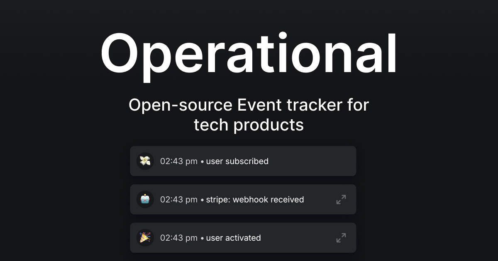

    <h1 align="center"><b>Operational.co</b></h1>

    Open-source Event tracker for tech products.
     
     
    <a href="https://operational.co">Website</a>
    ·
    <a href="https://operational.co/api">Docs</a>
    ·
    <a href="https://app.operational.co">Log in</a>
  

   
   

Operational is a open-source Event tracking tool. Monitor signups, webhooks, cronjobs and more. Operational is a Open source alternative to Logsnag, another Event tracking tool in the same category.

### Why use Operational?

- Get push notifications for critical events straight to your phone, or on the webapp
- Monitor

### Features

- Action buttons | Send events with actions buttons. When you receive the event, you can trigger webhooks using these action buttons.
- Contexts | Chain events together. Great for understanding complex workflows, signup processes, billing processes, etc.

### Highlights

- Very few 3rd party dependencies. No need to install clickhouse in the open source version.
- Feature packed. Send json, formatted json, bundle up logs in contexts, add action buttons, and more.
- Easy to grok and tear apart - no useless dependencies, nor unnecessarily complex code.

## How to install locally

- Make sure nodejx 20.x.x is installed
- Make sure mysql 8.x is installed

- git clone the repo
- cd to /backend and run `npm run install`
- Copy the env-template contents and create a .env file and fill it with the template's contents
- Fill in the content
- run `npm run dev`

- then cd to /app and run `npm run install`
- Copy the env-template contents and create a .env file and fill it with the template's contents
- Fill in the content
- run `npm run dev`

## How to install on your server

(Guide coming soon)

## Structure

This is a monorepo of 3 repos:

- /app the spa for operational.co
- /backend the expressjs api powering the backend
- /website nuxtjs marketing website

And the /packages folder has public npm packages which are shared across all repos.
