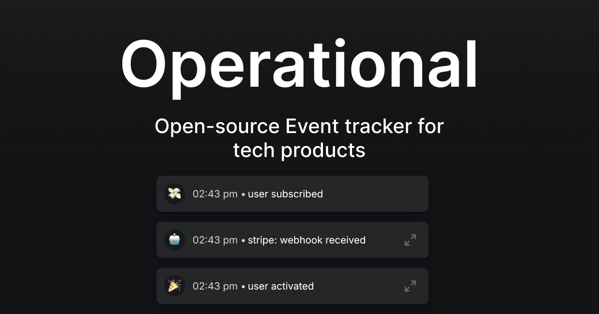

  

    <a href="https://operational.co" target="_blank">Website</a> |
    <a href="https://operational.co/api" target="_blank">Docs</a> |
    <a href="https://operational.co/selfhosted/introduction" target="_blank">Self-hosting</a> |
    <a href="https://operational.co/pitch" target="_blank">Pitch</a> |
    <a href="https://operational.co/other/vision" target="_blank">Vision</a>
      

[Operational.co](https://operational.co) is a open-source Event tracking tool. Monitor signups, webhooks, cronjobs and more.

Currently [Swipekit Facebook ad library tool](https://swipekit.app/articles/facebook-ads-library) and [youtubedescriptionextractor](https://youtubedescriptionextractor.com/) are using this in production.

  <strong><a href="https://app.operational.co/?signinas=kevin">🔍 View Live Demo</a></strong> - See Operational in action with a demo account receiving test events.

## ✨ Key Features

- Get push notifications for critical events straight to your phone, or on the webapp
- Monitor critical events
- Trigger webhooks via action buttons
- Understand complex events via contexts(events-in-events)
- Usable on mobile as a progressive web app(can receive push notifications on mobile too)
- Built for tech products

## 🚀 Getting Started

There are two ways to start using Operational:

| Option                                                             | Description                                   |
| ------------------------------------------------------------------ | --------------------------------------------- |
| **[Hosted Service](https://operational.co)**                       | Fastest way to get started                    |
| **[Self-Hosting](https://operational.co/selfhosted/introduction)** | Deploy and manage Operational on your own VPS |

📚 Explore our [documentation](https://operational.co/docs/start-here) to learn more about setup and usage.

## 🪄 Highlights

- Heaps of self-hosting options, from Render.com to docker images, with video guides. We want you to self-host!
- Very few 3rd party dependencies. No need to install clickhouse in the open source version.
- Feature packed. Send json, formatted json, bundle up logs in contexts, add action buttons, and more.
- Easy to grok and tear apart - no useless dependencies, nor unnecessarily complex code.

## 🏡 Community

We have a active [Discord](https://discord.gg/QmfGeMGM) community. We highly recommend jumping on our Discord server for updates, feedback and help.

## ⛏️ Contributing to Operational

[How to contribute?](https://operational.co/other/contributing)

## 👩‍🔬 Technology

Operational has a dead-simple tech stack:

- Nodejs >=18
- Mysql 8.x
- Prismajs
- Clickhouse(optional)
- Expressjs 5.x
- Vue 3
- Vite

Operational itself is a monorepo of 3 repos:

- /app the SPA for operational.co
- /backend the expressjs app powering the backend

- /website astrojs marketing website
- /packages folder has public npm packages which are shared across all repos.

## Bootstrap article

Use the article bootstrap command to create a new draft blog post and its banner assets.

Required env var:

- `OPENROUTER_API_KEY`

The command reads `OPENROUTER_API_KEY` from `website/.env` first, then falls back to your shell environment.

Examples:

- `npm --workspace website run bootstrap-article -- --title="My Article Title"`
- `npm --workspace website run bootstrap-article -- --slug="my-article-slug"`
- `npm --workspace website run bootstrap-article -- --title="My Article Title" --slug="my-article-slug"`

What it creates:

- `website/src/content/blog/{slug}.md`
- `website/public/images/blog/{slug}/banner.png`
- `website/public/images/blog/{slug}/banner-og.jpg`

Behavior:

- If only `title` is passed, the script slugifies it and uses that for the article slug.
- If only `slug` is passed, the script de-slugs it into a readable title.
- If both are passed, the script keeps the provided title and slug.
- The article is created as a draft with starter content.
- The script stops without overwriting anything if the target article already exists.
